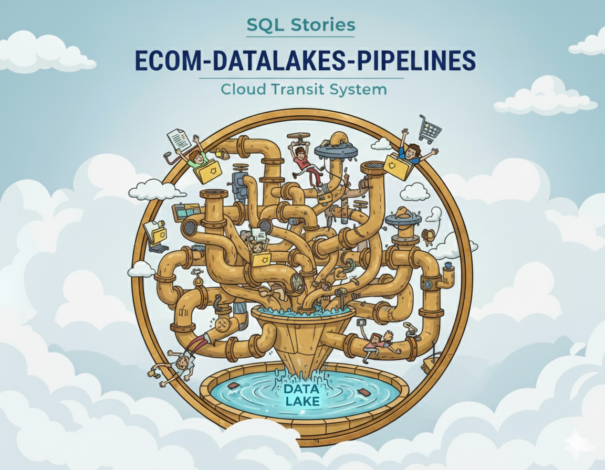

<p align="center">
  <sub>ecom-datalake-pipelines · Medallion lakehouse orchestration with dbt, DuckDB, and BigQuery</sub>
</p>
<p align="center">
  
  <br>
  <em>Bronze → Silver → Gold — Production-ready lakehouse transformation pipelines.</em>
</p>

<p align="center">
  
  
  
  
  
</p>

<p align="center">
  <a href="https://github.com/G-Schumacher44/ecom_datalake_pipelines/actions/workflows/pipeline-e2e.yml">
    
  </a>
  <a href="https://github.com/G-Schumacher44/ecom_datalake_pipelines/actions/workflows/python-quality.yml">
    
  </a>
  <a href="https://github.com/G-Schumacher44/ecom_datalake_pipelines/actions/workflows/dbt-validation.yml">
    
  </a>
  <a href="https://github.com/G-Schumacher44/ecom_datalake_pipelines/actions/workflows/docker-build.yml">
    
  </a>
  <a href="https://github.com/G-Schumacher44/ecom_datalake_pipelines/releases">
    
  </a>
</p>

---

# ecom-datalake-pipelines

A production-grade medallion lakehouse pipeline showcasing Bronze → Silver → Gold transformations for e-commerce analytics. Built with **dbt**, **DuckDB**, **BigQuery**, **Polars**, and **Airflow**, this project demonstrates modern data engineering patterns including data contracts, quality gates, schema evolution, and observability.

___

## 🧩 TLDR;

- **Bronze layer**: Raw Parquet ingestion from GCS with manifest validation and lineage metadata.
- **Base Silver (dbt-duckdb)**: Type-safe transformations, integrity checks, and deduplication using DuckDB.
- **Enriched Silver (Polars)**: Business-aligned tables with precomputed metrics, cohort analysis, and behavioral features built with pure Polars transforms.
- **Gold marts (dbt-bigquery)**: Aggregated analytics tables optimized for BI and reporting in BigQuery.
- **Orchestration**: Airflow DAGs coordinate Bronze → Silver → Gold flows with partition-level backfill and incremental processing.
- **Observability**: Audit trails, data quality metrics, and SLA monitoring baked into every transformation.
- **Spec-driven orchestration**: Layered YAML specs drive table lists, partitions, and gates (see [Spec Overview](docs/resources/SPEC_OVERVIEW.md)).


---

## ✅ Start Here

<details open>
<summary><strong>⚡ 3‑Minute Local Demo (Recommended)</strong></summary>
<br>

```bash
# 1) Unzip sample data
unzip samples/bronze_samples.zip -d samples/

# 2) Run the full local demo (matches CI exactly)
ecomlake local demo-full

# 3) Check outputs
ls data/silver/base/orders/ingestion_dt=2020-01-0{1,2,3,4,5}
ls data/silver/enriched/int_cart_attribution/cart_dt=2020-01-05
cat docs/validation_reports/SILVER_QUALITY_FULL.md
```

**What gets validated:**

- ✅ Dims: Generated for all 5 days from complete customer/product history
- ✅ Silver: 6/6 fact tables with 5-day lookback (creates partitions 2020-01-01 through 2020-01-05)
- ✅ Enriched: 10/10 business tables with full data
- ✅ dbt: 147 data quality tests pass

**Sample Data:**

The demo uses a complete 5-day Bronze sample (2020-01-01 through 2020-01-05):

- **Complete customer history**: All signups from 2019-01-01 through 2020-01-05 (370 partitions)
- **Complete product catalog**: All 5 categories (Books, Clothing, Electronics, Home, Toys)
- **5 days of fact tables**: orders, order_items, shopping_carts, cart_items, returns, return_items

This validates the entire pipeline including dims snapshot generation and multi-day lookback processing.

**Faster alternative:** Use `ecomlake local demo-fast` for single-day processing (~2 minutes)

</details>

<details>
<summary><strong>🐳 Run with Published Docker Image (No Build)</strong></summary>
<br>

```bash
unzip samples/bronze_samples.zip -d samples/
cp docker.env.local.example docker.env.local

DOCKER_ENV_FILE=docker.env.local \
PIPELINE_IMAGE=ghcr.io/g-schumacher44/ecom_datalake_pipelines \
PIPELINE_TAG=YOUR_TAG \
docker compose up -d --no-build
```

</details>

<details>
<summary> ⏯️ Quick Start</summary>

1. **Clone and set up environment**
   ```bash
   git clone https://github.com/YOUR_USERNAME/ecom-datalake-pipelines.git
   cd ecom-datalake-pipelines

   conda env create -f environment.yml
   conda activate ecom-datalake-pipelines
   pip install -e .
   pre-commit install
   ```

2. **Configure secrets and settings**
   ```bash
   cp .env.example .env
   # Edit .env with your GCS credentials and BigQuery project

   # Review pipeline config
   cat config/config.yml
   ```

3. **Pull sample Bronze data**
   ```bash
   unzip samples/bronze_samples.zip -d samples/

   # Profile your Bronze samples
   ecomlake bronze profile --date-range 2020-01-05..2020-01-05
   ```

4. **Run transformations locally**
   ```bash
   # Convenience CLI targets
   ecomlake local dims --date 2020-01-05
   ecomlake local silver --date 2020-01-05
   ecomlake local enriched --date 2020-01-05

   # Base Silver (DuckDB)
   cd dbt_duckdb
   dbt deps
   dbt build --target dev

   # Enriched Silver (Polars)
   ecomlake enriched run --base-path data/silver/base --output-path data/silver/enriched

   # Gold marts (BigQuery)
   cd dbt_bigquery
   dbt deps
   dbt build --target dev
   ```

_Note: Some enriched tables may be empty for 2024-01-03 because the sample archive does not include every table for every day._

5. **Spin up Airflow**
   ```bash
   ecomlake airflow up
   # Navigate to http://localhost:8080
   # To stop: ecomlake airflow down
   ```

6. **Run with the published Docker image (optional)**
   ```bash
   unzip samples/bronze_samples.zip -d samples/
   cp docker.env.local.example docker.env.local

   DOCKER_ENV_FILE=docker.env.local \
   PIPELINE_IMAGE=ghcr.io/g-schumacher44/ecom_datalake_pipelines \
   PIPELINE_TAG=YOUR_TAG \
   docker compose up -d --no-build
   ```

</details>

<details>
<summary> 📦 Sample Data Included</summary>

The repository comes pre-loaded with **Bronze Parquet samples** in `samples/bronze/` to enable immediate testing without cloud dependencies.

- **Tables**: `orders`, `order_items`, `customers`, `product_catalog`, `shopping_carts`, `cart_items`, `returns`, `return_items`
- **Partitions**:
  - `ingest_dt`: 2020-03-01, 2023-01-01, 2024-01-01..2024-01-03, 2025-10-01
  - `signup_date`: 2020-03-01, 2023-01-01, 2025-10-01
  - `category`: Books, Clothing, Electronics, Home, Toys
- **Size**: ~14MB compressed, ~18MB extracted
- **Rows**: ~194k total rows across 8 tables (see `docs/data/BRONZE_PROFILE_REPORT.md`)
- **Format**: Hive-partitioned Parquet with `_MANIFEST.json` files
- **Use Case**: Run full Bronze → Silver → Enriched transformations locally using DuckDB and Polars.
- **Profile refresh**: `ecomlake bronze profile --date-range 2024-01-01..2024-01-03`

</details>

---

## 📐 What's Included

- **Medallion architecture**: Bronze (raw) → Silver (clean, typed) → Gold (aggregated marts).
- **Spec-driven pipeline control**: Table lists, partitions, and validation gates live in `config/specs/*.yml`.
- **dbt-duckdb for Base Silver**: Leverage DuckDB's speed for local development and testing.
- **Polars for Enriched Silver**: Pure Python transforms for business logic, cohort analysis, and feature engineering.
- **dbt-bigquery for Gold marts**: SQL-based aggregations optimized for BI and reporting in BigQuery.
- **Data contracts**: Explicit Bronze → Silver type mapping and required field definitions.
- **Quality gates**: Primary key uniqueness, foreign key referential integrity, and non-negative numeric constraints.
- **Airflow orchestration**: DAGs for backfill, incremental processing, and partition-level recovery.
- **Observability**: Audit JSON emitted per table/partition, ready for SLA dashboards and alerting.
- **Dimension snapshot validation**: Lightweight quality gate for dimension snapshots (customers, product_catalog) ensuring schema and primary key integrity without expensive historical scans.
- **Self-documenting profiling**: Bronze profiling script auto-generates schema maps, data dictionaries, and quality reports from live data samples.

___

## 🧭 Orientation & Getting Started

<details><summary><strong>⚠️ Limitations & Constraints (Portfolio Scope)</strong></summary>
<br>

- **DuckDB single-writer**: Base Silver runs as a single dbt task to avoid file locks. In a warehouse-backed prod setup, split into per-model tasks for retries and observability.
- **GCS sync idempotency**: `gsutil rsync` is not atomic. For production, sync to a staging prefix, validate, then promote to canonical.
- **Batch-only assumptions**: The pipeline expects static Bronze partitions per run. Streaming/async ingestion could introduce "ghost" FK misses unless you snapshot or pin partitions.

</details>

<details>
<summary><strong>🧠 Notes from the Dev Team</strong></summary>
<br>

This pipeline was built to showcase end-to-end lakehouse best practices for portfolio and professional use. The Bronze layer ingests partitioned Parquet from GCS with full lineage metadata. Base Silver transforms raw data into clean, type-safe tables using dbt-duckdb for fast local iteration. Enriched Silver layers on business logic—customer cohorts, product velocity, order attribution—using pure Polars transforms for performance and testability. Gold marts aggregate Silver into analytics-ready fact and dimension tables in BigQuery.

Everything is designed for modularity and reusability: swap out buckets, adjust partition keys, or replace transformation engines—no rewrites needed. Data contracts define expectations, quality gates enforce them, and audit trails ensure visibility into every transformation.

**Self-Documenting Profiling System**: The Bronze profiling script doesn't just analyze data—it auto-generates documentation artifacts. Point it at your Bronze samples and it produces a comprehensive quality report, schema drift detection, a JSON schema map for programmatic use, updates your data contract with observed types, and even generates a data dictionary with field descriptions. Run it once and get your entire Bronze layer documented with real stats—no manual spreadsheet work required.

</details>

<details><summary><strong>📚 Resource Hub - Technical Documentation</strong></summary>
<br>

> **[👉 Click here to visit the full Resource Hub](RESOURCE_HUB.md)**

### 🏗️ Architecture & Design

- **[Architecture Overview](docs/resources/ARCHITECTURE.md)** - Complete system architecture and data flow
- **[Spec-Driven Orchestration](docs/resources/SPEC_OVERVIEW.md)** - YAML-based pipeline configuration pattern
- **[Configuration Strategy](docs/resources/CONFIG_STRATEGY.md)** - Config hierarchy and environment management
- **[Transformation Summary](docs/resources/TRANSFORMATION_SUMMARY.md)** - Catalog of all transforms (Base, Enriched, Gold)

### 🔍 Quality & Validation

- **[Validation Guide](docs/resources/VALIDATION_GUIDE.md)** - Three-layer validation framework (Bronze, Silver, Enriched)
- **[SLA & Quality Gates](docs/resources/SLA_AND_QUALITY.md)** - Quality thresholds and acceptance criteria
- **[Audit Schema](docs/planning/AUDIT_SCHEMA.md)** - Audit trail and observability metadata
- **[Observability Strategy](docs/resources/OBSERVABILITY_STRATEGY.md)** - Metrics, logging, and monitoring patterns

### ⚙️ Operations & Deployment

- **[Deployment Guide](docs/resources/DEPLOYMENT_GUIDE.md)** - Production deployment patterns and best practices
- **[CLI Usage Guide](docs/resources/CLI_USAGE_GUIDE.md)** - Command-line interface and common workflows
- **[Runbook](docs/resources/RUNBOOK.md)** - Operational procedures and troubleshooting
- **[Performance Tuning](docs/resources/PERFORMANCE_TUNING.md)** - Optimization strategies and benchmarks
- **[BigQuery Migration Guide](docs/planning/BQ_MIGRATION.md)** - Migration from local to warehouse execution

### 📊 Data & Self-Documenting Profiling

> **Self-Documenting System**: Documents below are auto-generated by profiling scripts. Run once and get comprehensive Bronze layer documentation with real stats.

**Bronze Data Profiling** (`ecomlake bronze profile`, legacy script: [`scripts/describe_parquet_samples.py`](scripts/describe_parquet_samples.py)):
- **[Bronze Profile Report](docs/data/BRONZE_PROFILE_REPORT.md)** ⚡ Quality report with schema drift detection
- **[Bronze Schema Map](docs/data/BRONZE_SCHEMA_MAP.json)** ⚡ Programmatic schema definitions (JSON)
- **[Data Contract](docs/resources/DATA_CONTRACT.md)** ⚡ Bronze → Silver type mapping (auto-updated)
- **[Data Dictionary](docs/data/DATA_DICTIONARY.md)** ⚡ Field definitions and business glossary

**Bronze Storage Analytics** (`ecomlake bucket report`, legacy script: [`scripts/report_bronze_sizes.sh`](scripts/report_bronze_sizes.sh)):
- **[Bronze Sizes Report](docs/data/BRONZE_SIZES.md)** ⚡ Bucket and per-table storage analysis

### 📜 Historical Planning Documents

> **Note**: These documents show the original planning and design process. For current implementation, see the sections above.

- **[Intent & Philosophy](docs/planning/INTENT.md)** ⭐ Original vision - Why "Rich Silver" matters
- **[Architectural Decisions](docs/planning/DECISIONS.md)** - Decision log with rationale and impact
- **[Silver Transformation Plan](docs/planning/SILVER_PLAN.md)** - Original transformation strategy
- **[Silver Framework](docs/planning/SILVER_FRAMEWORK.md)** - Initial framework design
- **[Enriched Silver Strategy](docs/planning/ENRICHED_SILVER_STRATEGY.md)** - Original enriched layer plan
- **[Architecture Summary](docs/planning/ARCHITECTURE_SUMMARY.md)** - Early architecture overview

</details>

<details>

<summary><strong>🗺️ About the Project Ecosystem</strong></summary>

This repository is part of a larger data engineering portfolio demonstrating end-to-end lakehouse capabilities:

* **[`ecom_sales_data_generator`](https://github.com/G-Schumacher44/ecom_sales_data_generator)** `(The Engine)`
  Generates realistic, relational e-commerce datasets with configurable volumes, seasonality, and messiness levels.
* **[`ecom-datalake-exten`](https://github.com/G-Schumacher44/ecom-datalake-exten)** `(The Lake Layer)`
  Converts generator CSV output to Parquet with Hive partitioning, lineage metadata, and GCS publishing.
* **[`ecom-datalake-pipelines`](https://github.com/YOUR_USERNAME/ecom-datalake-pipelines)** `(This Repo · The Transformation Layer)`
  Orchestrates Bronze → Silver → Gold transformations using dbt, DuckDB, BigQuery, and Airflow.
* **[`sql_stories_skills_builder`](https://github.com/G-Schumacher44/sql_stories_skills_builder)** `(Learning Lab)`
  Publishes story modules and exercises using these datasets for hands-on SQL and analytics practice.
* **[`sql_stories_portfolio_demo`](https://github.com/G-Schumacher44/sql_stories_portfolio_demo/tree/main)** `(The Showcase)`
  Curates case studies and analytics dashboards for professional portfolio storytelling.

</details>

<details>
<summary><strong>🫀 Version & Status</strong></summary>

### Current Version: v1.0.7

**Latest Release: [v1.0.7](https://github.com/G-Schumacher44/ecom_datalake_pipelines/releases/tag/v1.0.7)** - BQ Load & Gold Marts Reliability

**Changelog: [`CHANGELOG.md`](CHANGELOG.md)**

### Release History

- **v1.0.7** (2026-02-01): BQ load & gold marts reliability (partition typing fix, gold dataset wiring, secrets guidance)
- **v1.0.6** (2026-01-28): Staging promotion & validation workflow (Silver-to-Gold promotion, staging publishes, validation gates)
- **v1.0.5** (2026-01-27): Validation & backfill gates (enriched post-sync validation, dims backfill controls)
- **v1.0.4** (2026-01-27): Reliability + packaging patch (CLI fixes, dbt log path, Airflow date floor)
- **v1.0.3** (2026-01-26): CLI suite release (ecomlake command, docs migration, deprecation warnings)
- **v1.0.2** (2026-01-25): Fixed Bronze sample completeness for honest dims validation
  - Complete 5-day Bronze sample (2020-01-01 through 2020-01-05)
  - Complete customer history (370 partitions from 2019-01-01)
  - Removed pre-cooked dims workaround
  - CI now validates actual dims generation from Bronze data
  - Includes cart_items table in sample

- **v1.0.0** (2026-01-23): Initial feature-complete release
  - Full Bronze → Silver → Gold pipeline
  - Three-layer validation framework
  - Airflow orchestration
  - 51% test coverage

### Current Status: Production-Ready

- ✅ Project scaffolding and config setup
- ✅ Bronze profiling and schema validation
- ✅ dbt-duckdb Base Silver models (8 tables + quarantine)
- ✅ Data contract and quality gate definitions
- ✅ Polars Enriched Silver transforms (10 domain runners)
- ✅ dbt-bigquery Gold mart aggregations (8 fact tables)
- ✅ Airflow DAG orchestration (2 DAGs with full Bronze→Gold flow)
- ✅ Structured observability (metrics, logging, audit trails)
- ✅ Three-layer validation framework (Bronze, Silver, Enriched)
- ✅ Honest sample data with complete dims validation


</details>

<details>
<summary><strong>💪 Future Enhancements</strong></summary>

- **Incremental materialization**: Optimize Silver transformations with incremental models and merge strategies.
- **CLI improvements**: Click-based `ecomlake` CLI is now the primary interface; Makefile/scripts are deprecated.
- **Great Expectations**: Add data quality profiling and anomaly detection.
- **SLA dashboards & alerting**: Publish SLA metrics and alert on quality gate breaches.
- **Workload Identity**: Document and optionally wire production-grade auth (GKE/Composer/Cloud Run).

</details>

<details>
<summary>⚙️ Project Structure</summary>

```
ecom-datalake-pipelines/
├── airflow/
│   ├── dags/                   # Airflow DAG definitions
│   ├── docker-compose.yml      # Local Airflow setup
│   └── config/                 # Airflow configuration
├── config/
│   ├── config.yml              # Pipeline settings (buckets, prefixes, targets)
│   └── specs/                  # YAML-driven pipeline definitions
├── dbt_duckdb/                 # Base Silver dbt project (DuckDB)
│   ├── models/
│   │   └── base_silver/        # Type-safe, integrity-checked Silver tables
│   ├── macros/                 # Custom dbt macros for cleaning & validation
│   └── dbt_project.yml
├── dbt_bigquery/               # Gold dbt project (BigQuery)
│   ├── models/
│   │   ├── enriched_silver/    # External tables pointing to GCS
│   │   └── gold_marts/         # Aggregated analytics marts (Fact/Dim)
│   └── dbt_project.yml
├── docs/
│   ├── data/                   # Auto-generated profiling reports
│   ├── img/                    # Project assets & diagrams
│   ├── planning/               # Architecture docs & design logs
│   ├── resources/              # Deep-dive technical documentation
│   └── validation_reports/     # Pipeline run quality reports
├── samples/
│   └── bronze/                 # Sample Parquet data (multi-period slices)
├── scripts/                     # Legacy entrypoints (deprecated)
│   ├── describe_parquet_samples.py  # Bronze profiling & self-doc engine
│   └── run_enriched_all_samples.py  # Local Polars transformation runner
├── src/
│   ├── transforms/             # Pure Polars business logic
│   ├── runners/                # I/O orchestration & domain runners
│   ├── validation/             # Multi-layer QA gate logic
│   ├── observability/          # Structured logging & audit trails
│   ├── specs/                  # Spec loading & validation models
│   └── settings.py             # Pydantic environment configuration
├── tests/                      # pytest suite (Unit & Integration)
├── Makefile                    # Legacy developer commands (use ecomlake)
└── README.md
```

</details>

---

## 🏗️ Architecture & Engineering Decisions

<details>

<summary><strong>🗺️ Medallion Architecture Diagram</strong></summary>

```
┌─────────────────────────────────────────────────────────────────┐
│ BRONZE (Raw)                                                    │
│ • GCS Parquet (Hive partitioned by ingest_dt)                  │
│ • Lineage metadata: batch_id, event_id, ingestion_ts           │
│ • Manifest validation: row counts, checksums                   │
└─────────────────────────────────────────────────────────────────┘
                              ↓
┌─────────────────────────────────────────────────────────────────┐
│ BASE SILVER (dbt-duckdb)                                        │
│ • Type casting and normalization                                │
│ • Deduplication by primary key                                  │
│ • Foreign key validation                                        │
│ • Null handling and integrity checks                            │
│ • Partitioned by event_dt                                       │
└─────────────────────────────────────────────────────────────────┘
                              ↓
┌─────────────────────────────────────────────────────────────────┐
│ DIMENSION SNAPSHOTS (dbt-duckdb)                                │
│ • Daily snapshots of customers & products                       │
│ • Freshness gates avoid re-reading Bronze                       │
│ • Validated schema & PK integrity                               │
└─────────────────────────────────────────────────────────────────┘
                              ↓
┌─────────────────────────────────────────────────────────────────┐
│ ENRICHED SILVER (Polars runners)                                │
│ • Customer cohorts and LTV segmentation                         │
│ • Product velocity and inventory metrics                        │
│ • Order attribution and channel analysis                        │
│ • Returns risk scoring                                          │
│ • Precomputed features for ML                                   │
│ • Written to GCS, then loaded into BigQuery                     │
└─────────────────────────────────────────────────────────────────┘
                              ↓
┌─────────────────────────────────────────────────────────────────┐
│ GOLD (dbt-bigquery)                                             │
│ • Aggregated fact tables (daily sales, returns)                 │
│ • Dimension tables (customers, products, dates)                 │
│ • BI-optimized views for Looker/Tableau                         │
│ • Incremental marts with SCD Type 2 support                     │
└─────────────────────────────────────────────────────────────────┘
```

</details>

<details>

<summary><strong>🛠️ Technology Stack</strong></summary>

- **Bronze Layer**: GCS Parquet ingestion with manifest & lineage validation.
- **Base Silver**: dbt-duckdb for type-safe normalization & deduplication.
- **Dimension Snapshots**: dbt-duckdb + Python for efficient daily SCD-like snapshots.
- **Enriched Silver**: High-performance Polars transforms for complex business logic & cohorts.
- **Gold Marts**: dbt-bigquery for SQL-based analytics & BI-ready aggregates.
- **Orchestration**: Airflow (Docker) using dynamic TaskGroups & spec-driven DAGs.
- **Observability**: JSON audit trails, SLA monitoring, and structured logging.
- **Validation**: Three-layer quality gates (Bronze/Silver/Enriched) with strict-mode enforcement.
- 🧪**Testing**: Pytest for transform logic and dbt data tests for SQL integrity.

</details>

<details>

<summary><strong>🧠 Why Hybrid? (Cost & Polars Analysis)</strong></summary>

### 💰 Cost Analysis (Hybrid vs. Warehouse-Only)

This architecture intentionally offloads compute-heavy transformations to local/containerized runners (DuckDB/Polars) to minimize BigQuery slot usage.

| Component | Standard (BigQuery Only) | Hybrid (DuckDB + Polars + BigQuery) | Why? |
|-----------|--------------------------|--------------------------------------|------|
| **Base Silver** | High (Slot usage for dedup/cleaning) | **$0** (Local/Container compute) | Raw row processing is CPU-bound; DuckDB handles it efficiently. |
| **Enriched** | High (Complex Python UDFs / SQL Joins) | **$0** (Local/Container compute) | Polars executes complex window/cohort logic 10-100x faster than SQL. |
| **Storage** | BigQuery Active Storage ($$) | **GCS Standard Storage ($)** | Keeping detailed Silver data in GCS is cheaper than BQ active storage. |
| **Gold Marts** | Low (Aggregations) | Low (Aggregations) | BigQuery is excellent for final serving layer aggregations. |
| **Est. Monthly** | ~$500+ (Compute + Storage) | **~$150** (VM + GCS + minimal BQ) | **~70% Cost Reduction** |

### ⚡ Why Polars for Enriched Silver?

While SQL is excellent for aggregation, it struggles with complex procedural logic like:
- **Sessionization & Attribution**: Linking cart sessions to orders with time windows.
- **Iterative Cohort Analysis**: Calculating LTV and retention across rolling windows.
- **Complex Window Functions**: Recursive stock checks and inventory risk scoring.

**Polars** allows us to write this logic in pure Python with:
1.  **Testability**: Unit test complex logic with `pytest` without a warehouse connection.
2.  **Performance**: Vectorized execution on a single node is often faster than distributed shuffle for these datasets.
3.  **Expressiveness**: Clean, readable Python code vs. 1000-line SQL CTE spaghetti.

</details>
___

## ▶️ Setup

### 🔩 Configuration Setup

Pipeline settings are controlled via YAML config and environment variables.

<details>
<summary><strong>Environment variables</strong></summary>

Copy `.env.example` to `.env` and populate with your credentials:

```bash
# GCS settings
GCS_RAW_BUCKET=gcs-automation-project-raw
GCS_SILVER_BUCKET=gcs-automation-project-silver
GCS_PREFIX=ecom/raw

# BigQuery settings
BQ_PROJECT=your-gcp-project
BQ_DATASET_SILVER=ecom_silver
BQ_DATASET_GOLD=ecom_gold

# Auth (local/dev defaults to ADC)
# gcloud auth application-default login
# Optional service account (prod-style)
USE_SA_AUTH=true
GOOGLE_APPLICATION_CREDENTIALS=/path/to/service-account.json
```

For Docker-based local/dev runs, make sure your ADC file is mounted into the
container (see `docker-compose.yml` for the default gcloud config mount).

</details>

<details>
<summary><strong>Pipeline config (config.yml)</strong></summary>

Configure partition keys, quality thresholds, and transformation rules:

```yaml
bronze:
  bucket: gcs-automation-project-raw
  prefix: ecom/raw
  partition_key: ingest_dt

silver:
  bucket: gcs-automation-project-silver
  prefix: ecom/silver
  partition_key: event_dt

quality_gates:
  allow_nulls_in_pk: false
  max_duplicate_pk_pct: 0.01
  min_row_count: 1
```

</details>

### 📦 Dev Setup

<details>
<summary><strong>Conda environment (recommended)</strong></summary>
<br>

```bash
conda env create -f environment.yml
conda activate ecom-datalake-pipelines
pip install -e .
pre-commit install
```

</details>

<details>
<summary><strong>Pure pip / virtualenv option</strong></summary>
<br>

```bash
python -m venv .venv
source .venv/bin/activate
pip install -e .
pre-commit install
```

</details>

### 🧭 CLI Quickstart

<details>
<summary><strong>Help & Quick Start</strong></summary>
<br>

```bash
# Show top-level help
ecomlake -h

# Show help for a group
ecomlake bronze -h
ecomlake airflow -h

# Quick start (minimal)
ecomlake bronze profile --date-range 2020-01-05..2020-01-05
ecomlake local demo
```

</details>

<details>
<summary><strong>examples</strong></summary>
<br>

```bash
# Profile Bronze samples
ecomlake bronze profile --date-range 2020-01-05..2020-01-05

# Run local pipeline (dims → silver → enriched)
ecomlake local dims --date 2020-01-05
ecomlake local silver --date 2020-01-05
ecomlake local enriched --date 2020-01-05

# Note: in prod/prod-sim, enriched validation runs post-sync and checks GCS outputs.

# Run full local demo (5-day sample)
ecomlake local demo

# Airflow (local)
ecomlake airflow up
ecomlake pipeline run-sample --date 2024-01-03
ecomlake airflow down
```

</details>

___

### ▶️ Usage

**New CLI (recommended)**: use the Click-based `ecomlake` CLI. Legacy Makefile targets and direct script/module entrypoints are in deprecation and will emit warnings.

Example:

```bash
ecomlake bronze profile --date-range 2025-10-01..2025-10-01
```

<details>
<summary><strong>Profile Bronze samples (self-documenting)</strong></summary>
<br>

The profiling CLI auto-generates multiple documentation artifacts from live data:

```bash
# Run full profiling + doc refresh for the included sample archive (bronze_samples.zip)
ecomlake bronze profile \
  --date-range 2025-10-01..2025-10-01 \
  --output docs/data/BRONZE_PROFILE_REPORT.md \
  --schema-json docs/data/BRONZE_SCHEMA_MAP.json \
  --update-contract docs/data/DATA_CONTRACT.md \
  --data-dictionary docs/data/DATA_DICTIONARY.md

# Basic profile: generates quality report with schema drift detection
ecomlake bronze profile --date-range 2025-10-01..2025-10-01

# Profile specific tables or months
ecomlake bronze profile --tables orders,customers --months 2025-10

# Generate schema JSON map for programmatic use
ecomlake bronze profile \
  --date-range 2025-10-01..2025-10-01 \
  --schema-json docs/data/BRONZE_SCHEMA_MAP.json

# Auto-update data contract with observed Bronze → Silver type mappings
ecomlake bronze profile \
  --date-range 2025-10-01..2025-10-01 \
  --update-contract docs/resources/DATA_CONTRACT.md

# Generate data dictionary with field descriptions
ecomlake bronze profile \
  --date-range 2025-10-01..2025-10-01 \
  --data-dictionary docs/data/DATA_DICTIONARY.md \
  --update-contract docs/resources/DATA_CONTRACT.md
```

**Outputs**: Quality report (markdown), schema map (JSON), updated data contract, and data dictionary—all generated from real data, no manual editing required.

</details>

<details>
<summary><strong>Run transformations</strong></summary>
<br>

```bash
# Base Silver (DuckDB)
cd dbt_duckdb
dbt deps
dbt build --target dev --select base_silver.*

# Enriched Silver (Polars runners)
ecomlake enriched run \
  --base-path data/silver/base \
  --output-path data/silver/enriched

# Gold marts (BigQuery)
cd dbt_bigquery
dbt deps
dbt build --target dev --select gold.*

# Run dbt tests only
dbt test --target dev
```

</details>

<details>
<summary><strong>Run Airflow locally</strong></summary>
<br>

```bash
# Initialize and start Airflow services
ecomlake airflow up

# Access Airflow UI
open http://localhost:8080
# Default credentials: airflow / airflow

# Stop Airflow
ecomlake airflow down
```

</details>

<details>
<summary><strong>Run Python tests</strong></summary>
<br>

```bash
# Run all tests
ecomlake dev test

# Run specific test file
pytest tests/test_validation.py -v

# Run with coverage
pytest --cov=src tests/
```

</details>

___

## 🧪 Testing and Validation Guide

<details>
<summary>🎯 Test Objectives</summary>

- Validate Bronze profiling detects schema drift and data quality issues.
- Ensure Base Silver transformations enforce data contracts and quality gates.
- Verify Enriched Silver Polars transforms correctly compute business metrics and cohorts.
- Test Airflow DAGs for partition-level idempotency and backfill logic.

</details>

<details>
<summary>🛠️ Running the Tests</summary>

```bash
# Python unit tests
pytest tests/ -v

# dbt tests (Base Silver)
cd dbt_duckdb && dbt test --target dev

# dbt tests (Gold marts)
cd dbt_bigquery && dbt test --target dev

# Polars transform unit tests
pytest tests/test_transforms.py -v

# Pre-commit hooks (lint, format, type checks)
pre-commit run --all-files
```

</details>

___

## 🤝 On Generative AI Use

Generative AI tools (Claude Sonnet 4.5, ChatGPT, Gemini) were used throughout this project as part of an integrated workflow—supporting code generation, documentation refinement, architecture design, and problem-solving. These tools accelerated development and improved quality, but the system design, logic, and documentation reflect intentional, human-led decisions. This repository demonstrates a collaborative process: where automation enhances productivity, and iteration deepens mastery.

---

## 📦 Licensing

This project is licensed under the [MIT License](LICENSE).

---

## 🙌 Contributions

This repository is a portfolio showcase and is not currently accepting external contributions or PRs.

___

---

<p align="center">
  <a href="README.md">🏠 <b>Home</b></a>
  &nbsp;·&nbsp;
  <a href="RESOURCE_HUB.md">📚 <b>Resource Hub</b></a>
</p>

<p align="center">
  <sub>Last updated: 2026-01-28</sub><br>
  <sub>✨ Transform the data. Tell the story. Build the future. ✨</sub>
</p>
