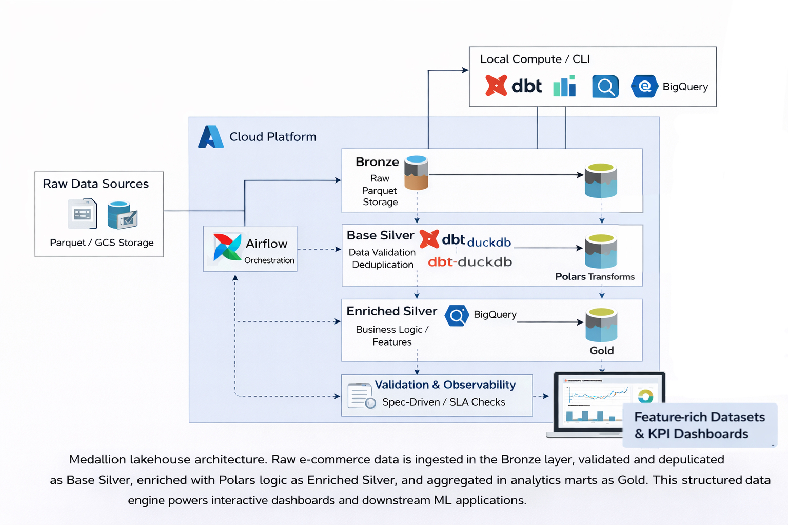
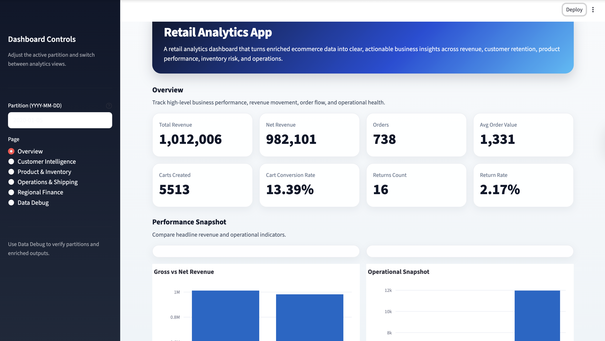

# Ecommerce-DataLakeHouse
A medallion lakehouse pipeline showcasing Bronze → Silver → Gold transformations for e-commerce analytics. Built with **dbt**, **DuckDB**, **BigQuery**, **Polars**, and **Airflow**, this project demonstrates modern data engineering patterns including data contracts, quality gates, schema evolution, and observability.

<p align="center">
  
  <br>
  <em>Ecommerce Data Lakehouse Architecture</em>
</p>

___

## 🧩 Description

- **Medallion lakehouse architecture**: Bronze (raw) → Silver (clean, typed) → Gold (aggregated marts).
  - **Bronze layer**: Raw Parquet ingestion from GCS with manifest validation and lineage metadata.
  - **Base Silver (dbt-duckdb)**: Type-safe transformations, integrity checks, and deduplication using DuckDB.
  - **Enriched Silver (Polars)**: Business-aligned tables with precomputed metrics, cohort analysis, and behavioral features built with pure Polars transforms.
  - **Gold marts (dbt-bigquery)**: Aggregated analytics tables optimized for BI and reporting in BigQuery.

- **Airflow orchestration**: Bronze → Silver → Gold workflows are coordinated with partition-aware scheduling, incremental processing, and backfill support.

- **Built-in observability**: Audit trails, quality checks, and SLA-style validation are embedded throughout the pipeline.

- **Spec-driven design**: Layered YAML specs control table definitions, partitions, and validation gates.

- **ML-ready insights**: The enriched data layer is designed to support customer intelligence, behavioral analytics, cohort analysis, and future predictive use cases through reusable feature-oriented tables.

- **Interactive apps and dashboards**: Streamlit-based analytics apps sit on top of the lakehouse outputs to surface executive KPIs, customer insights, and product / inventory intelligence in a user-friendly interface.

- **End-to-end portfolio project**: This repository demonstrates a complete analytics engineering workflow, from raw ingestion and transformation to business-facing dashboards and ML-oriented insight generation.

## 📐 Structure
```
ecom-datalake-pipelines/
├── airflow/
│   ├── dags/                         # Airflow DAG definitions
│   ├── docker-compose.yml            # Local Airflow setup
│   └── config/                       # Airflow configuration
├── apps/                             # Streamlit analytics apps
│   ├── streamlit_dashboard.py        # Main business-facing dashboard app
│   ├── charts.py                     # Reusable chart components / plotting logic
│   └── data_loader.py                # Extracting data from Enriched Silver layer
├── config/
│   ├── config.yml                    # Pipeline settings (buckets, prefixes, targets)
│   └── specs/                        # YAML-driven pipeline definitions
├── dbt_duckdb/                       # Base Silver dbt project (DuckDB)
│   ├── models/
│   │   └── base_silver/              # Type-safe, integrity-checked Silver tables
│   ├── macros/                       # Custom dbt macros for cleaning & validation
│   └── dbt_project.yml
├── dbt_bigquery/                     # Gold dbt project (BigQuery)
│   ├── models/
│   │   ├── enriched_silver/          # External tables pointing to GCS
│   │   └── gold_marts/               # Aggregated analytics marts (Fact/Dim)
│   └── dbt_project.yml
├── docs/
│   ├── data/                         # Auto-generated profiling reports
│   ├── img/                          # Project assets, diagrams, and screenshots
│   └── validation_reports/           # Pipeline run quality reports
├── ml/
│   ├── features/                     # ML-ready feature definitions / feature engineering logic
│   ├── insights/                     # Customer, product, and behavioral insight generation
├── samples/
│   └── bronze/                       # Sample Parquet data (multi-period slices)
├── scripts/
│   ├── describe_parquet_samples.py   # Bronze profiling & self-doc engine
│   └── run_enriched_all_samples.py   # Local Polars transformation runner
├── src/
│   ├── transforms/                   # Pure Polars business logic
│   ├── runners/                      # I/O orchestration & domain runners
│   ├── validation/                   # Multi-layer QA gate logic
│   ├── observability/                # Structured logging & audit trails
│   ├── specs/                        # Spec loading & validation models
│   ├── serving/                      # Data-serving helpers for dashboards / downstream apps
│   └── settings.py                   # Pydantic environment configuration
├── tests/                            # pytest suite (Unit & Integration)
```
---

## ✅ Start Here

<details open>
<summary><strong>⚡ 3‑Minute Local Demo (Recommended)</strong></summary>
<br>

```bash
# 1) Unzip sample data
unzip samples/bronze_samples.zip -d samples/

# 2) Run the full local demo (matches CI exactly)
ecomlake local demo-full

# 3) Check outputs
ls data/silver/base/orders/ingestion_dt=2020-01-0{1,2,3,4,5}
ls data/silver/enriched/int_cart_attribution/cart_dt=2020-01-05
cat docs/validation_reports/SILVER_QUALITY_FULL.md
```

**What gets validated:**

- ✅ Dims: Generated for all 5 days from complete customer/product history
- ✅ Silver: 6/6 fact tables with 5-day lookback (creates partitions 2020-01-01 through 2020-01-05)
- ✅ Enriched: 10/10 business tables with full data
- ✅ dbt: 147 data quality tests pass

**Sample Data:**

The demo uses a complete 5-day Bronze sample (2020-01-01 through 2020-01-05):

- **Complete customer history**: All signups from 2019-01-01 through 2020-01-05 (370 partitions)
- **Complete product catalog**: All 5 categories (Books, Clothing, Electronics, Home, Toys)
- **5 days of fact tables**: orders, order_items, shopping_carts, cart_items, returns, return_items

This validates the entire pipeline including dims snapshot generation and multi-day lookback processing.

**Faster alternative:** Use `ecomlake local demo-fast` for single-day processing (~2 minutes)

</details>

<details>
<summary> ⏯️<strong> Quick Start</strong></summary>

1. **Clone and set up environment**
   ```bash
   git clone https://github.com/YOUR_USERNAME/ecom-datalake-pipelines.git
   cd ecom-datalake-pipelines

   conda env create -f environment.yml
   conda activate ecom-datalake-pipelines
   pip install -e .
   pre-commit install
   ```

2. **Configure secrets and settings**
   ```bash
   cp .env.example .env
   # Edit .env with your GCS credentials and BigQuery project

   # Review pipeline config
   cat config/config.yml
   ```

3. **Pull sample Bronze data**
   ```bash
   unzip samples/bronze_samples.zip -d samples/

   # Profile your Bronze samples
   ecomlake bronze profile --date-range 2020-01-05..2020-01-05
   ```

4. **Run transformations locally**
   ```bash
   # Convenience CLI targets
   ecomlake local dims --date 2020-01-05
   ecomlake local silver --date 2020-01-05
   ecomlake local enriched --date 2020-01-05

   # Base Silver (DuckDB)
   cd dbt_duckdb
   dbt deps
   dbt build --target dev

   # Enriched Silver (Polars)
   ecomlake enriched run --base-path data/silver/base --output-path data/silver/enriched

   # Gold marts (BigQuery)
   cd dbt_bigquery
   dbt deps
   dbt build --target dev
   ```

_Note: Some enriched tables may be empty for 2024-01-03 because the sample archive does not include every table for every day._

5. **Spin up Airflow**
   ```bash
   ecomlake airflow up
   # Navigate to http://localhost:8080
   # To stop: ecomlake airflow down
   ```

</details>

___

## 🧪 Testing and Validation Guide

<details>
<summary>🎯 Test Objectives</summary>

- Validate Bronze profiling detects schema drift and data quality issues.
- Ensure Base Silver transformations enforce data contracts and quality gates.
- Verify Enriched Silver Polars transforms correctly compute business metrics and cohorts.
- Test Airflow DAGs for partition-level idempotency and backfill logic.

</details>

<details>
<summary>🛠️ Running the Tests</summary>

```bash
# Python unit tests
pytest tests/ -v

# dbt tests (Base Silver)
cd dbt_duckdb && dbt test --target dev

# dbt tests (Gold marts)
cd dbt_bigquery && dbt test --target dev

# Polars transform unit tests
pytest tests/test_transforms.py -v

# Pre-commit hooks (lint, format, type checks)
pre-commit run --all-files
```

</details>

___

## 📃 What You Get

- **Analytics-ready data products**  
  Cleaned and validated Bronze → Silver → Gold datasets with business metrics, cohort features, and operational KPIs.

- **Feature-rich datasets for BI & ML**  
  Structured outputs designed to support dashboards, experimentation, and future machine learning workflows.

- **Interactive dashboard application**  
  A Streamlit-based retail analytics app providing insights into revenue, customer behavior, product performance, and operations.

<p align="center">
  
  <br>
  <em>Retail Analytics App</em>
</p>

- **End-to-end data platform**  
  A fully reproducible pipeline covering ingestion, transformation, validation, and data serving.

___

## 📚 References & Inspiration

This project builds upon established data engineering patterns and real-world implementations of lakehouse systems:

- **Medallion Architecture (Bronze → Silver → Gold)**  
  https://github.com/MekWiset/Medallion_DataLakehouse  
  A reference implementation using Azure Data Factory, Databricks, and dbt to structure data pipelines into layered transformations. :contentReference[oaicite:2]{index=2}  

- **Production Data Pipelines with Databricks DLT**  
  https://github.com/jrlasak/databricks_apparel_streaming  
  Demonstrates production-oriented pipeline design, including streaming ingestion, data quality expectations, and scalable transformations. :contentReference[oaicite:3]{index=3}  

Compared to these implementations, this project emphasizes:
- Local-first + cloud hybrid compute (DuckDB, Polars, BigQuery)
- Spec-driven pipeline control and validation
- End-to-end analytics delivery, including dashboards and ML-ready datasets