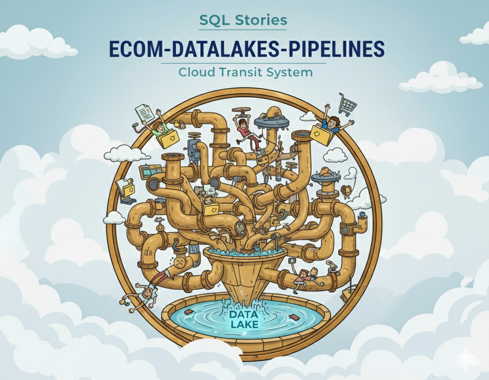

  ecom-datalake-pipelines · Medallion lakehouse orchestration with dbt, DuckDB, and BigQuery

  
   
  <em>Resource Hub — Technical Documentation & Engineering Specifications.</em>

  
  
  
  

  
  
  
  
  

---

# 📚 Resource Hub

Welcome to the central documentation repository for the **ecom-datalake-pipelines** project. This hub serves as a comprehensive guide for engineers, architects, and stakeholders to understand the system design, operational procedures, and data governance framework.

---

## 🏗️ Architecture & Design

Deep dives into the structural foundations of the medallion lakehouse.

*   **[Architecture Overview](docs/resources/ARCHITECTURE.md)** — Complete system architecture, data flow, and component breakdown.
*   **[Spec-Driven Orchestration](docs/resources/SPEC_OVERVIEW.md)** — How YAML metadata drives dynamic DAG generation and table definitions.
*   **[Configuration Strategy](docs/resources/CONFIG_STRATEGY.md)** — Hierarchy of environment variables, Pydantic settings, and spec files.
*   **[Transformation Summary](docs/resources/TRANSFORMATION_SUMMARY.md)** — Detailed catalog of all Base, Enriched, and Gold transformation logic.
*   **[Environment Variables](docs/resources/ENVIRONMENT_VARIABLE_STRATEGY.md)** — Detailed mapping of all configuration flags and their impacts.

---

## 🔍 Quality, Validation & Observability

Standardizing reliability through automated gates and structured monitoring.

*   **[Validation Guide](docs/resources/VALIDATION_GUIDE.md)** — The three-layer validation framework (Bronze, Silver, Enriched).
*   **[SLA & Quality Gates](docs/resources/SLA_AND_QUALITY.md)** — Definitions for quality thresholds, row loss tolerance, and acceptance criteria.
*   **[Observability Strategy](docs/resources/OBSERVABILITY_STRATEGY.md)** — How structured JSON logging and audit trails enable production monitoring.
*   **[Audit Schema](docs/planning/AUDIT_SCHEMA.md)** — Technical specification for the audit metadata emitted by every run.

---

## ⚙️ Operations & Deployment

Guides for running, scaling, and maintaining the pipeline across environments.

*   **[Deployment Guide](docs/resources/DEPLOYMENT_GUIDE.md)** — Production patterns for Cloud Composer (GCP), Kubernetes, and VM-based installs.
*   **[CLI Usage Guide](docs/resources/CLI_USAGE_GUIDE.md)** — Command-line interface documentation and common developer workflows.
*   **[Runbook](docs/resources/RUNBOOK.md)** — Step-by-step procedures for recovery, troubleshooting, and daily operations.
*   **[Performance Tuning](docs/resources/PERFORMANCE_TUNING.md)** — Optimization strategies for DuckDB, Polars, and BigQuery slot management.
*   **[BigQuery Migration](docs/planning/BQ_MIGRATION.md)** — Strategy for moving from local DuckDB execution to full warehouse scale.
*   **[Docker Versioning](docs/resources/DOCKER_VERSIONING.md)** — Tagging strategies and container lifecycle management.

---

## 🧪 Testing & Development

Frameworks for ensuring logic correctness and developer productivity.

*   **[Testing Guide](docs/resources/TESTING_GUIDE.md)** — Comprehensive testing strategy across pytest (Python) and dbt (SQL).
*   **[Testing Runbook](docs/planning/TESTING_RUNBOOK.md)** — Procedures for validating new features and regression testing.

---

## 📊 Data Governance & Contracts

Auto-generated documentation reflecting the live state of the data lake.

*   **[Data Contract](docs/data/DATA_CONTRACT.md)** — Formal type mappings and field requirements between Bronze and Silver.
*   **[Data Dictionary](docs/data/DATA_DICTIONARY.md)** — Business glossary and field-level descriptions.
*   **[Bronze Profile Report](docs/data/BRONZE_PROFILE_REPORT.md)** — Auto-generated quality report with schema drift detection.
*   **[Bronze Sizes Report](docs/data/BRONZE_SIZES.md)** — Storage analytics and partition size tracking.

---

## 📜 Historical Planning & Strategy

The original vision and decision logs that shaped the project.

*   **[Intent & Philosophy](docs/planning/INTENT.md)** — Why we prioritize "Rich Silver" and Hybrid compute.
*   **[Architectural Decisions (ADR)](docs/planning/DECISIONS.md)** — Log of key engineering choices and their rationale.
*   **[Enriched Silver Strategy](docs/planning/ENRICHED_SILVER_STRATEGY.md)** — Original design document for the behavioral enrichment layer.
*   **[Silver Transformation Plan](docs/planning/SILVER_PLAN.md)** — Initial strategy for normalization and deduplication.

---

  <a href="README.md">🏠 <b>Home</b></a>
  &nbsp;·&nbsp;
  <a href="RESOURCE_HUB.md">📚 <b>Resource Hub</b></a>

  Last updated: 2026-01-24 
  ✨ Transform the data. Tell the story. Build the future. ✨

