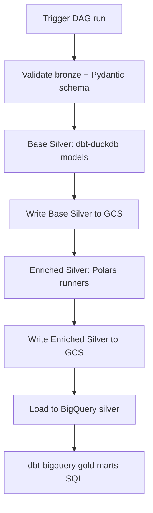
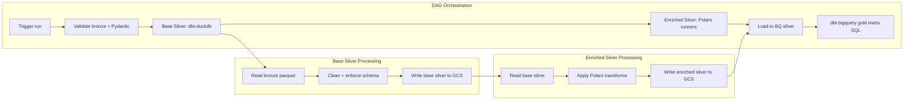

# Bronze to Silver Plan (Base + Enriched)

> **📌 HISTORICAL DOCUMENT - Original Transformation Plan (Pre-Implementation)**
>
> This document represents the initial transformation strategy and planning for the Bronze → Silver pipeline.
> For **current implementation details and architecture**, see:
> - [ARCHITECTURE.md](../resources/ARCHITECTURE.md) - Current system architecture
> - [SPEC_OVERVIEW.md](../resources/SPEC_OVERVIEW.md) - Spec-driven orchestration pattern
> - [TRANSFORMATION_SUMMARY.md](../resources/TRANSFORMATION_SUMMARY.md) - Current transformation logic
>
> **Status**: ✅ Implemented - Core plan executed with enhancements (spec-driven orchestration, dimension snapshots, three-layer validation)

## Context
We have a 6-year historical backlog (~17GB) in the bronze/raw GCS bucket. Data is partitioned by
`ingest_dt=YYYY-MM-DD` and includes `_MANIFEST.json` per partition. The goal is to produce a clean,
query-ready Base Silver layer and a Rich (Enriched) Silver layer for downstream analytics.

## Goals
- Create repeatable bronze -> base silver transforms with integrity-focused cleaning.
- Produce enriched silver tables with precomputed behavioral attributes.
- Keep orchestration in Airflow; keep transformation logic in dbt + reusable Polars modules.

## Non-goals (for now)
- Real-time processing or streaming ingestion.
- Real-time BI serving (batch only).

## Inputs (Bronze)
- Location: `gs://gcs-automation-project-raw/ecom/raw/...`
- Partitioning: `ingest_dt=YYYY-MM-DD`
- Manifest: `_MANIFEST.json` per partition

## Outputs (Silver)
- Base Silver: `gs://<silver-bucket>/silver/ecom/base/<table>/<partition_key>=YYYY-MM-DD/`
- Enriched Silver: `gs://<silver-bucket>/silver/ecom/enriched/<table>/<partition_key>=YYYY-MM-DD/`
- Metadata: row counts, schema version, and run ID per partition

## Current Bronze Tables (Reference)
See `docs/data/BRONZE_SCHEMA_MAP.json` for the current table list and schemas.

## Silver Table Shape
- Base Silver stays 1:1 with bronze tables (no split/merge).
- Enriched Silver introduces new business-aligned tables (attribution, risk, retention, velocity).

## Data Contract and SLAs
- Data contract: `docs/resources/DATA_CONTRACT.md`
- SLAs and quality checks: `docs/planning/SLA_AND_QUALITY.md`
- BigQuery migration: `docs/planning/BQ_MIGRATION.md`
- Transform framework: `docs/planning/SILVER_FRAMEWORK.md`
- Testing runbook: `docs/planning/TESTING_RUNBOOK.md`
- Decision log: `docs/planning/DECISIONS.md`

## Cleaning + Integrity Rules (Draft)
General
- Enforce schema and types (timestamps, numeric precision).
- Trim strings, normalize casing for enums, standardize nulls.
- Drop duplicate rows based on business keys.
- Require primary keys to be non-null and unique.
- Parse all date/time strings to timestamps and derive `event_dt` (date).
- Base Silver uses soft quarantine: invalid/FK-fail rows are written to quarantine outputs with reasons, while valid rows remain in Base Silver.

## Base Silver Standardization Rules (Profile-Driven)
Based on the Bronze profile report, Base Silver should include explicit normalization:

- Normalize literal `"None"`, `"null"`, and empty strings to nulls for all string columns.
- Trim whitespace and lowercase enum-like fields (e.g., `signup_channel`, `customer_status`, `loyalty_tier`).
- Treat `product_id` as the canonical product key; keep `product_name` as descriptive only.
- Parse timestamps from string fields (`order_date`, `added_at`, `created_at`, `updated_at`) with fallback to null + reject logging.
- Enforce non-negative numeric fields; quarantine rows that violate hard constraints.

### Table-Specific Casting Rules
- orders: cast `order_date` to timestamp; cast totals to float; parse `is_expedited` to boolean.
- order_items: cast `quantity` to int, `unit_price`/`discount_amount`/`cost_price` to float.
- customers: cast `signup_date` to date; parse boolean flags (`is_guest`, `email_verified`, `marketing_opt_in`).
- product_catalog: cast `unit_price`/`cost_price` to float, `inventory_quantity` to int.
- shopping_carts: cast `created_at`/`updated_at` to timestamp; cast `cart_total` to float.
- cart_items: cast `added_at` to timestamp; cast `quantity` to int; `unit_price` to float.
- returns: cast `return_date` to timestamp; cast `refunded_amount` to float.
- return_items: cast `quantity_returned` to int; `unit_price`/`cost_price`/`refunded_amount` to float.

Orders
- `order_id` required, unique.
- `customer_id` required and must exist in customers (FK check).
- `order_date` parseable; derive `order_dt` and `event_dt`.
- `gross_total`, `net_total`, `total_discount_amount` >= 0.
- `net_total` <= `gross_total` (flag if violated).

Order items
- Composite key: (`order_id`, `product_id`).
- `order_id` must exist in orders (FK).
- `quantity` > 0; `unit_price` >= 0; `discount_amount` >= 0.
- Derive `event_dt` from orders (preferred) or fallback to `ingest_dt`.

Customers
- `customer_id` required, unique.
- Standardize `email` to lowercase and trim whitespace.
- `signup_date` parseable; derive `signup_dt` and `event_dt`.
- `age` within reasonable bounds (e.g., 13-110) else null.

Product catalog
- `product_id` required, unique.
- `unit_price` >= 0; `cost_price` >= 0; `inventory_quantity` >= 0.
- Standardize `category` and `product_name` casing.
- `event_dt` = `ingest_dt` (no business date present).

Shopping carts
- `cart_id` required, unique.
- `customer_id` must exist in customers (FK).
- `created_at`/`updated_at` parseable; use `updated_at` if present else `created_at`.
- `cart_total` >= 0.

Cart items
- `cart_item_id` required, unique.
- `cart_id` must exist in shopping_carts (FK).
- `product_id` must exist in product_catalog (FK).
- `quantity` > 0; `unit_price` >= 0.
- `added_at` parseable; derive `event_dt`.

Returns
- `return_id` required, unique.
- `order_id` must exist in orders (FK).
- `customer_id` must exist in customers (FK).
- `return_date` parseable; derive `return_dt` and `event_dt`.
- `refunded_amount` >= 0.

Return items
- `return_item_id` required, unique.
- `return_id` must exist in returns (FK).
- `order_id` must exist in orders (FK).
- `product_id` must exist in product_catalog (FK).
- `quantity_returned` > 0; `refunded_amount` >= 0.

## Partition Strategy
- Prefer business date per table (derived from event timestamps).
- Use `ingest_dt` when no business date exists.
- Keep partitions small and query-friendly (daily), even when the backfill shares a single ingest date.

Per-table recommendation
- orders: `order_dt`
- order_items: `order_dt` (via join to orders), fallback `ingestion_ts`
- customers: `signup_dt`
- product_catalog: `category`
- shopping_carts: `created_dt` or `updated_dt`
- cart_items: `added_dt`
- returns: `return_dt`
- return_items: `return_dt` (via join to returns), fallback `ingestion_ts`

## DAG Orchestration (Table-Level Processing)

### Overview

Bronze is a one-time backfill (~17GB) with daily partitions and a single ingest date. Instead of processing by date partition, we process by **table** to:

- Enable parallelism (8 Base + 5 Enriched tasks run concurrently)
- Fit in laptop memory (~9.6GB peak vs 17GB+ for full dataset)
- Provide natural boundaries for monitoring and retry logic

### Phase 1: Base Silver (8 parallel tasks)

Each task processes one Bronze table independently using dbt-duckdb:

1. `stg_ecommerce__cart_items` (9.6GB) - largest table
2. `stg_ecommerce__shopping_carts` (3.0GB)
3. `stg_ecommerce__customers` (2.2GB)
4. `stg_ecommerce__order_items` (1.3GB)
5. `stg_ecommerce__orders` (717MB)
6. `stg_ecommerce__product_catalog` (80MB)
7. `stg_ecommerce__return_items` (45MB)
8. `stg_ecommerce__returns` (33MB)

**Processing pattern per task**:

- Read Bronze parquet from GCS via DuckDB httpfs extension
- Apply cleaning and integrity rules (type casting, deduplication, FK checks)
- Write Base Silver parquet to `/tmp/silver_base_{table}/`
- Upload to `gs://<silver-bucket>/silver/ecom/base/{table}/ingest_dt=2020-01-01/`
- Delete local temp files

**Peak memory**: ~9.6GB (cart_items table)

### Phase 2: Enriched Silver (10 parallel tasks)

Each task reads only required Base Silver tables and produces one enriched table:

1. `int_attributed_purchases` (reads: carts, orders) - Cart attribution via `join_asof`
2. `int_cart_attribution` (reads: carts, cart_items, orders) - Cart conversion + abandonment
3. `int_inventory_risk` (reads: products, order_items, returns) - Stock risk scoring
4. `int_customer_retention_signals` (reads: customers, orders) - Churn signals
5. `int_customer_lifetime_value` (reads: customers, orders, returns) - CLV and segments
6. `int_daily_business_metrics` (reads: orders, carts, returns) - KPI rollups
7. `int_product_performance` (reads: products, order_items, returns, carts) - Profitability
8. `int_sales_velocity` (reads: orders, order_items) - Rolling 7-day velocity
9. `int_regional_financials` (reads: orders, customers) - Tax + FX calculations
10. `int_shipping_economics` (reads: orders) - Shipping margin analysis

**Processing pattern per task**:

- Read Base Silver parquet(s) from GCS into Polars DataFrame
- Apply Polars transforms from `src/transforms/` modules
- Write Enriched Silver parquet to `/tmp/silver_enriched_{table}/`
- Upload to `gs://<silver-bucket>/silver/ecom/enriched/{table}/ingest_dt=2026-01-10/`
- Delete local temp files

**Peak memory**: ~12GB (int_attributed_purchases needs carts 3GB + orders 717MB + overhead)

### Phase 3: Load to BigQuery

- Load all Enriched Silver parquet files as external tables (metadata-only, free tier)
- Alternative: Use `bq load` for native tables if query performance needed

### Phase 4: Gold Marts (dbt-bigquery)

- Run dbt models against BigQuery Silver dataset
- Produce aggregated marts (Customer Lifecycle, Product Performance, etc.)

## Backfill Strategy
- Parameterize DAG to run by batch window.
- Support batch windows to reduce overhead.
- Make runs idempotent (overwrite or upsert partition outputs).

## Observability
- Emit metrics per table: input rows, output rows, rejects.
- Log failed integrity checks with sample row IDs.
- Store run metadata in a small audit table or JSON in GCS.
- Preferred: publish audit logs to a BigQuery metadata table (see `docs/planning/planning/BQ_MIGRATION.md`).
- Bronze manifests are used for ingestion completeness checks; Silver emits its own audit logs per partition.
- Local dev: audit logs can be persisted to a DuckDB table for low-cost querying.

## Governance and Access
- GCS: bucket-level IAM with least-privilege service accounts for Airflow/dbt.
- BigQuery: dataset-level roles for Business Intelligence and Data Science, separate from Data Engineering.
- Retention: keep audit logs for 90 days (configurable); keep gold marts according to BI retention policy.

## Open Questions
- Confirm event dates for partitioning where derived via joins.
- Decide silver storage bucket + prefix.
- Decide BQ load strategy: external tables vs. scheduled load.
- Confirm enriched table naming and partition keys.
- Define audit log retention window and alerting thresholds.

## Risks and Owners (Draft)
- Event date derivation (joins may be incomplete) — Owner: Data Engineering. Mitigation: fallback to `ingest_dt` and log join miss rate per run.
- FK integrity gaps in bronze data — Owner: Data Engineering. Mitigation: quarantine invalid rows and emit reject metrics with sample IDs.
- Silver bucket/prefix decision — Owner: Platform Engineering. Mitigation: use a temporary `gs://<silver-bucket>` placeholder and update config once confirmed.
- BQ publish mode decision — Owner: Business Intelligence. Mitigation: start with external tables and document migration to native tables later.

## Next Steps
- Validate assumptions with one bronze partition + manifest.
- Finalize schemas and cleaning rules per table.
- Implement base silver dbt models and tests.
- Implement Polars transforms and dbt Python wrappers.
- Wire Airflow DAG with run-on-trigger params.

## Phase Checklist
- [ ] Confirm bronze table list and schemas.
- [ ] Inspect one `ingest_dt` partition + `_MANIFEST.json`.
- [ ] Decide silver partition key (event date vs. `ingest_dt`).
- [ ] Define cleaning + integrity rules per table.
- [ ] Define silver schema versioning strategy.
- [ ] Implement base silver dbt models.
- [ ] Implement Polars transforms in `src/transforms`.
- [ ] Implement enriched dbt Python models.
- [ ] Implement validation + metadata publishing.
- [ ] Wire Airflow DAG with run-on-trigger params.
- [ ] Backfill via batch windows.
- [ ] Validate outputs in GCS and BigQuery.

## One-Week Delivery Plan (Draft)
- Day 1-2: finalize plan, schema versioning, rules, and partitioning; review sample schemas.
- Day 3-4: implement base silver dbt models and Polars transforms; add unit tests.
- Day 5: wire DAG; run a small batch window.
- Day 6-7: validate outputs; update docs; optional BQ publish.

## Flowchart (Mermaid)

## Swimlane Flow (Mermaid)

---

  <a href="../../README.md">🏠 <b>Home</b></a>
  &nbsp;·&nbsp;
  <a href="../../RESOURCE_HUB.md">📚 <b>Resource Hub</b></a>

  Last updated: 2026-01-24 
  ✨ Transform the data. Tell the story. Build the future. ✨

